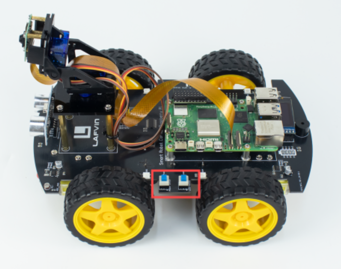

# ROS2 Four Wheel Robot

**ROS2 Four Wheel Robot** is the Raspberry Pi–side ROS 2(kilted) package responsible for directly interfacing with the robot's hardware components: motors, servos, LEDs, buzzer, OLED screen, line sensors, ADC (LDR, battery voltage), ultrasonic distance sensor, and camera.

This package exposes ROS 2 topics and services that allow remote control and sensor monitoring of the robot from a PC or onboard logic.



---

## 🔌 Hardware Controlled

| Component        | Interface               | ROS Topic(s)                                     |
|------------------|--------------------------|--------------------------------------------------|
| **Motors**       | 4-wheel driver via PWM   | `/cmd_vel` (`geometry_msgs/Twist`)              |
| **Servos**       | PWM                      | `/servo/0/angle`, `/servo/1/angle`              |
| **LEDs**         | SPI (WS2812/NeoPixel)    | `/led/set_color` (`Int32MultiArray`)            |
| **Buzzer**       | GPIO                     | `/buzzer` (`std_msgs/Bool`)                     |
| **OLED Display** | I2C                      | `/oled_text` (`std_msgs/String`)                |
| **Line Sensors** | GPIO (IR modules)        | `/line_tracking` (`Int8MultiArray`)             |
| **Ultrasonic**   | GPIO (HC-SR04)           | `/ultrasonic/distance` (`sensor_msgs/Range`)    |
| **ADC Sensors**  | SPI/I2C ADC (LDR, batt)  | `/sensors/ldr_left`, `/sensors/ldr_right`, `/sensors/battery_voltage` (`Float32`) |
| **Camera**       | PiCam or USB via OpenCV  | `/image_raw` (`sensor_msgs/Image`)              |

---

## 🧩 Nodes Overview

| Node                    | Function                                     |
|-------------------------|----------------------------------------------|
| `robot_controller_node` | Handles motor movement from `/cmd_vel`      |
| `servo_controller_node` | Sets servo positions from angle topics      |
| `led_controller_node`   | Controls LEDs via RGB values                |
| `line_tracking_node`    | Publishes 3 IR sensors                      |
| `adc_sensor_node`       | Reads LDR + battery voltage via ADC        |
| `ultrasonic_node`       | Publishes distance in meters               |
| `buzzer_node`           | Activates buzzer on `Bool(True)`           |
| `oled_display_node`     | Displays 2-line string messages             |
| `camera_node`           | Publishes video stream                      |

---

## 📦 Installation

```bash
cd ~/ros2_ws/src
git clone https://github.com/robidev/ros2_four_wheel_robot.git
cd ~/ros2_ws
colcon build --packages-select four_wheel_bot
source install/setup.bash
```

---

## 🚀 Launching

You can launch nodes individually or create a custom launch file:

```bash
ros2 run four_wheel_bot robot_controller_node
ros2 run four_wheel_bot led_controller_node
ros2 run four_wheel_bot line_tracking_node
...
```

Or add your own `four_wheel_bot.launch.py`.

---

## 🧪 Testing with ROS 2 Topics

```bash
# Drive forward
ros2 topic pub /cmd_vel geometry_msgs/msg/Twist "{linear: {x: 0.2}, angular: {z: 0.0}}"

# Set servo angle
ros2 topic pub /servo/0/angle std_msgs/msg/Float32 "data: 90"

# Turn on red LED at index 0
ros2 topic pub /led/set_color std_msgs/msg/Int32MultiArray "{data: [0, 255, 0, 0]}"

# Display message on OLED
ros2 topic pub /oled_text std_msgs/msg/String "data: 'Hello\nWorld!'"

# Enable buzzer
ros2 topic pub /buzzer std_msgs/msg/Bool "data: true"
```

---

## 📜 License

MIT License. Created for embedded robotics experimentation.
